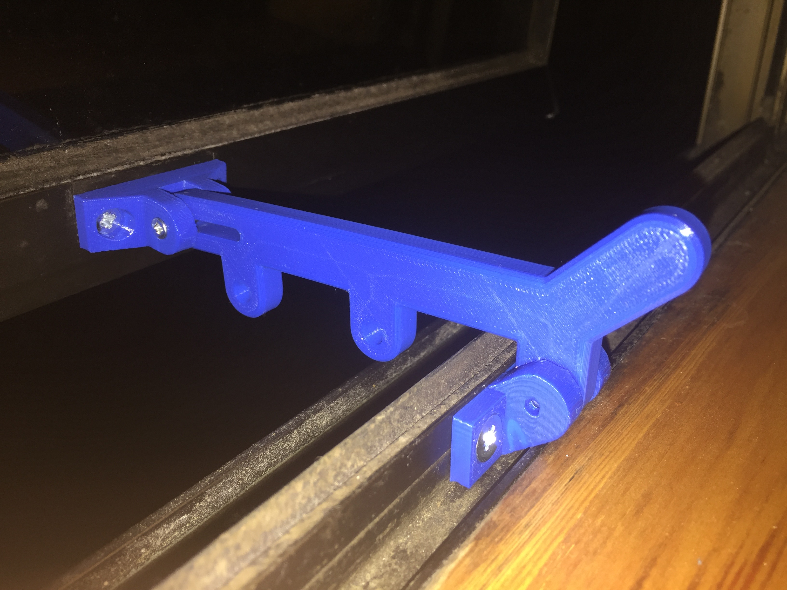
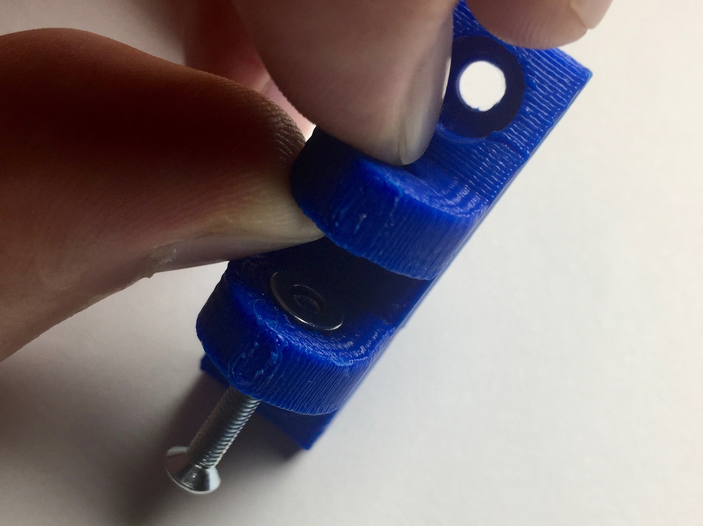
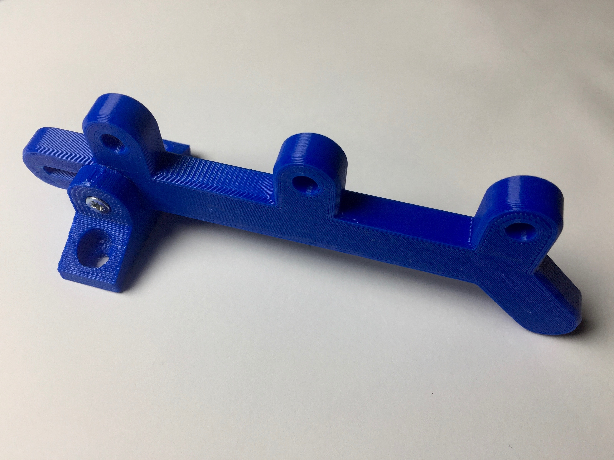
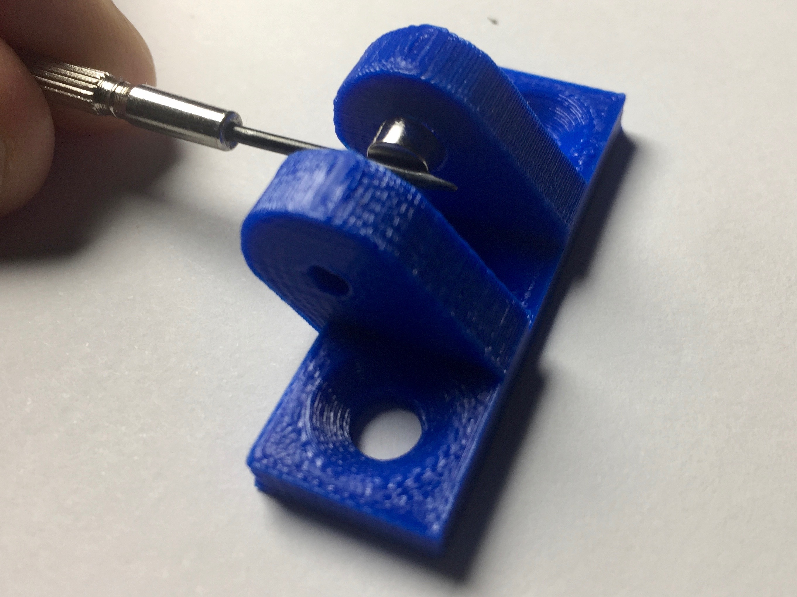
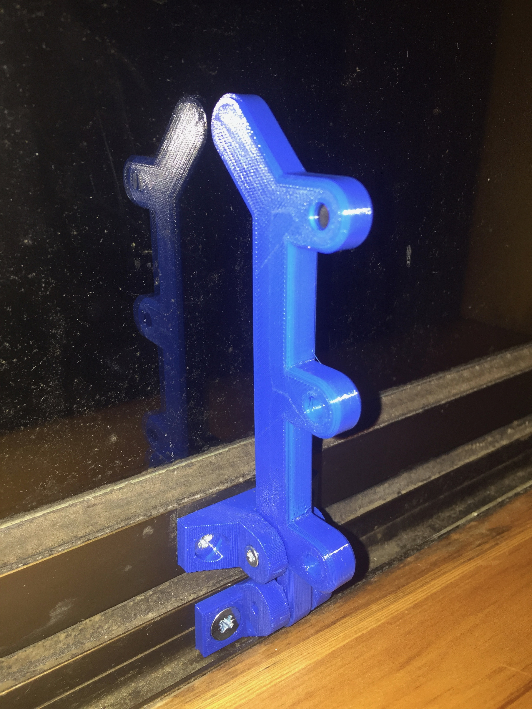

# Window Latch

This repository contains parts for replacing existing window latches on aluminium windows.

## Motivation

My house has lots of old window latches which are in various states of functionality. Some of them still work quite well, while others are missing the various clamping and/or latching parts. Some windows have lost the ability to open to a certain angle.

## Parts Required

Per latch:

- 1x M3x20mm counter-sunk screws for the hinge.
- 2x M4x8mm for the top bracket (this is going to depend on your existing fixtures).
- 2x M5x8mm for the bottom bracket (this is going to depend on your existing fixtures).
- 2x M3x7mm washers for the slip joint.
- 2x M5x3mm magnets for the bottom bracket.
- 3x M5x8mm magnets for the bar.

## Instructions

This part will likely need to be modified for your exact measurements. In my house, I found the top bracket required M4 screws while the bottom bracket required M5. Various alignments of these holes both in terms of horizontal displacement as well as vertical displacement were observed. The latch has a certain amount of flexibility. Additionally, the latching mechanism requires precise positioning w.r.t. the window outer window frame, the inner window frame and the window glass itself.

### Top Bracket & Bar

The upper latching mechanism works best if two washers are inserted before screwing together. One can be positioned using gravity, the other must be held in place using dexterity while inserting the bar. once everything is in position, you can screw in the M3x20mm bolt to hold everything in position. If you screw this too tightly, the latch will not move easily.

Once completed, it should look something like this:

### Bottom Bracket

The bottom bracket works best if two magnets are inserted into it, to provide a slightly better latching mechanism.

If you prefer, you can remove the magnets, and use anther M3x20mm bolt to lock the mechanism completely e.g. for security on rarely used windows.

### Installation

It seems sufficient simply to screw into the existing aluminium frame. Sometimes the window is not aligned horizontally, and the latch would be hard to push down. The best solution is to simply open the window and give it a small yank to try and correct it. Sometimes spraying some CRC/WD40 helps too.

## Contributing

1. Fork it
2. Create your feature branch (`git checkout -b my-new-feature`)
3. Commit your changes (`git commit -am 'Add some feature'`)
4. Push to the branch (`git push origin my-new-feature`)
5. Create new Pull Request

## License

Released under the MIT license.

Copyright, 2017, by [Samuel G. D. Williams](http://www.codeotaku.com/samuel-williams).

Permission is hereby granted, free of charge, to any person obtaining a copy
of this software and associated documentation files (the "Software"), to deal
in the Software without restriction, including without limitation the rights
to use, copy, modify, merge, publish, distribute, sublicense, and/or sell
copies of the Software, and to permit persons to whom the Software is
furnished to do so, subject to the following conditions:

The above copyright notice and this permission notice shall be included in
all copies or substantial portions of the Software.

THE SOFTWARE IS PROVIDED "AS IS", WITHOUT WARRANTY OF ANY KIND, EXPRESS OR
IMPLIED, INCLUDING BUT NOT LIMITED TO THE WARRANTIES OF MERCHANTABILITY,
FITNESS FOR A PARTICULAR PURPOSE AND NONINFRINGEMENT. IN NO EVENT SHALL THE
AUTHORS OR COPYRIGHT HOLDERS BE LIABLE FOR ANY CLAIM, DAMAGES OR OTHER
LIABILITY, WHETHER IN AN ACTION OF CONTRACT, TORT OR OTHERWISE, ARISING FROM,
OUT OF OR IN CONNECTION WITH THE SOFTWARE OR THE USE OR OTHER DEALINGS IN
THE SOFTWARE.